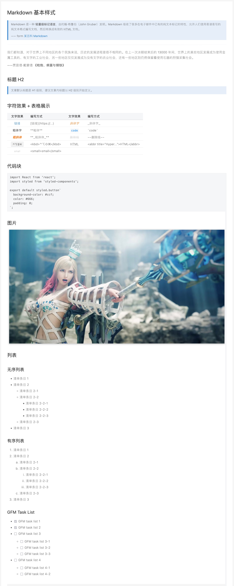
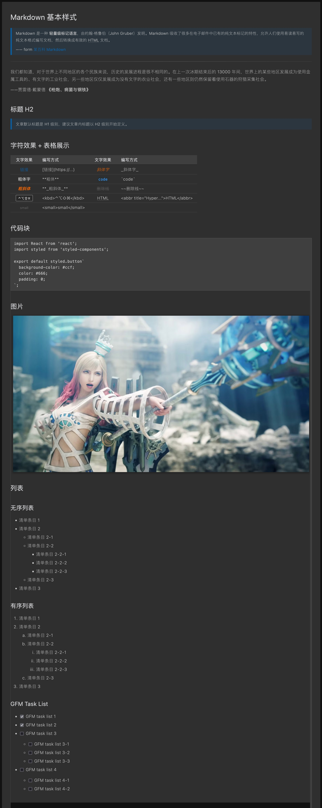

# Juejin 主题 - 极简主义

## License

MIT

## 介绍

文章就是看着清爽最好，不要过多花哨的样式和颜色，本主题特点：

1. 支持暗黑模式
2. 字体粗细温和，默认 200，粗体用 400，没有 600
3. 行距、段落间距适中
4. 表格的展示能适应 90% 的展示场景（`th` 不折行、`td` 最小 72px 宽度），不至于有些内容被压缩得特别难看
5. `em` 元素为橙色
6. 支持 `kbd`

## 效果图

### 亮色

### 暗色

